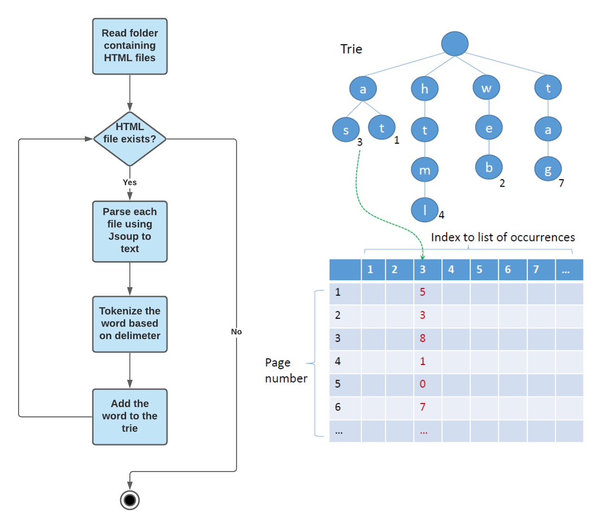
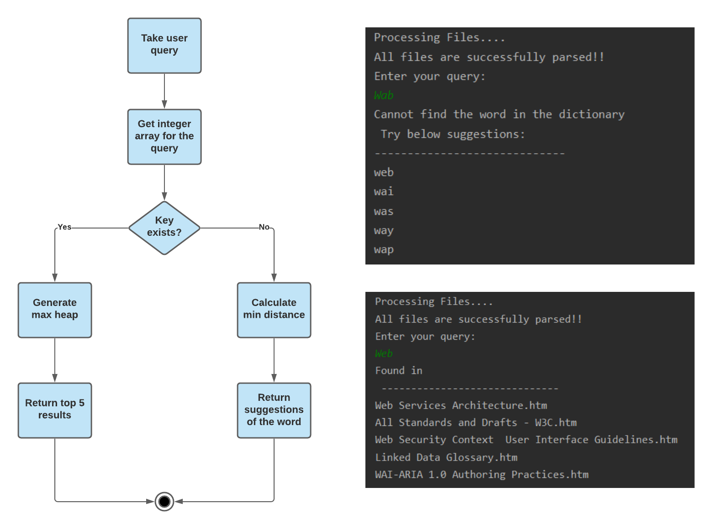

# About the Project

Web search engine to convert HTML files into text files and then search for the keyword entered by the user. To convert HTML to text files, Jsoup is used which is a Java library for working with real-world HTML. It provides a very convenient API for extracting and manipulating data

# Technologies Used

- [Java](https://java.com/en/download/)
- [Jsoup](https://jsoup.org/)

# Flow

#### Parse the HTML files

#### Parse the user search query

